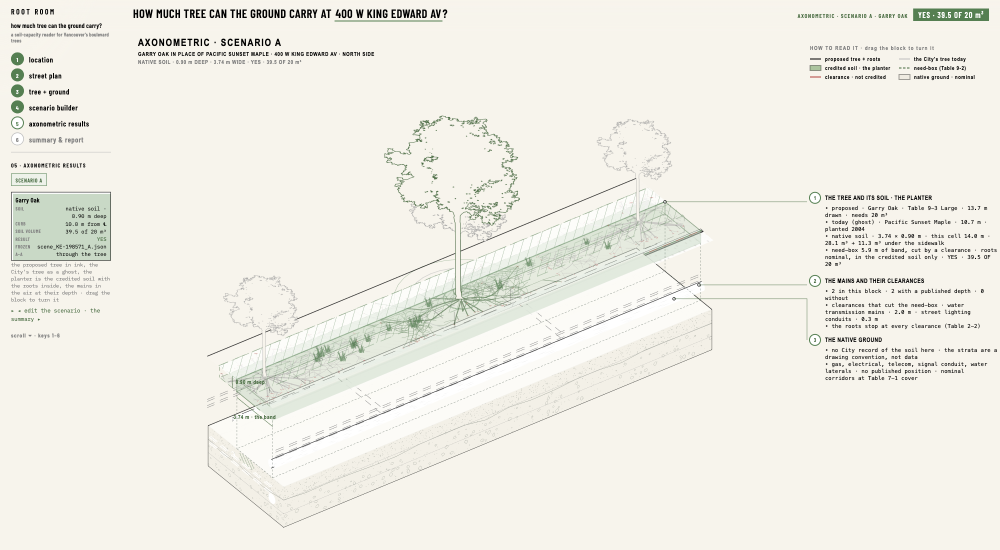

# Root Room

**How much tree can the ground carry?**
A soil-capacity reader for Vancouver's boulevard trees.



Root Room takes one public street tree in Vancouver, reads what the City publishes about the ground around it
(the street's width, the mains and conduits with their clearances, the sidewalk, the neighbours), and answers one
question with the City's own rule: **how much tree can this piece of boulevard carry**, under the Engineering Design
Manual 2026 §9.3 Table 9-2 soil volumes? You then design the ground — depth, soil system, extensions under the sidewalk or
the parking lane — and watch the answer change, in section and in an exploded axonometric.

Every number on the page is read from the engine's file, and every value carries where it came from:
CITY RECORD · DERIVED · ASSUMED · NO RECORD. The tool never invents a curb line, a soil depth or a utility depth; it says
when the City has none.

---

## Run it

Requirements: **Python 3.10+**, one package, and a desktop browser with internet access (the page loads three.js and jsPDF
from a CDN; new streets are fetched live from City of Vancouver Open Data).

```bash
pip install jsonschema
python3 scripts/serve_web.py --port 8767
```

Open **http://127.0.0.1:8767/** in a window of at least 1500 × 800. The pilot street, 400 W King Edward Av, is ready to
use; the repository carries its City data. Any other street works too and takes about two minutes the first time (the
City data for that area is fetched once and kept).

---

## How to use it

One question runs through the page and one continuous scroll answers it in six stages on one drawing. The rail on the
left lists the stages; click them, or press **1–6**, or use the arrow keys.

### 1 · Location — the atlas
The map of Vancouver's 22 local areas, shaded by how many of their public trees are species the City recommends.
**Scroll = zoom, click = choose.**

| level | what you see | what a click does |
|---|---|---|
| CITY | the 22 areas | an area: the map drops to it, the rail lists its checked streets |
| AREA | the checked streets in colour (the largest Table 9-2 class the band carries) | a street: it loads and the page lands on its plan |
| BLOCK | every public tree as a dot (ink = a Table 9-3 species, grey = other) | a tree: it opens at stage 3 |

The search box takes any address or tree asset id. **WHAT THE TOOL READS** lists the City layers and the rule sources.

### 2 · Street plan
The whole block face: houses, parcels, the sidewalk, the band, every tree as a disc with its share of the band's soil
(m³) and the spacing between trees. Click a tree: its SECTION A–A opens beside the plan. Drag the A–A line along the
street to cut through a neighbour.

### 3 · Tree + ground
The selected tree in section, at true scale, with what the City knows: height and DBH, the soil the rule gives it (band
width × its cell), what cuts the band (a main's Table 2-2 clearance), and whether any existing soil is on record. The
right column tags every fact. ASSUMPTIONS folds the curb, land use and sidewalk width; the curb can be corrected with
evidence. **DESIGN A SCENARIO →** goes on.

### 4 · Scenario builder
Design the ground, see how much tree it can carry.

- **Left — what you can move.** The premise (keep the City's tree, or a replacement), the soil depth (a slider; let go and
  the rule runs, about 40 s), the soil system (native · structural · soil cells), and two extension proposals: under the
  sidewalk and under the parking lane. The engine checks each against the mains and answers CONNECTED or NOT CONNECTED.
- **Centre — the ground answers in section.** SECTION A–A across the street with the credited soil, the need-box, the
  clearances in red; SECTION B–B along the band with the neighbours and their cells.
- **Right — what it can support.** Physical and credited soil volume, the Table 9-2 tiles (Small 5 · Medium 15 · Large
  20 m³ for a shared row), the classes that fit and their Table 9-3 species with the spacing range, one result, and
  **VIEW SPATIAL RESULT →**, which freezes the scenario as a file (`data/processed/scene_<site>_<A|B|C>.json`).

### 5 · Axonometric results
The block of street as 02–04 left it, exploded: the credited soil lifted as a planter with the roots drawn inside it,
the mains in the air at their recorded depth, the native ground as a drawn soil section (a convention, the City publishes
none). Drag to turn it. Saved scenarios appear as tabs; nothing has to be saved to see the current state.

### 6 · Summary & report
The saved scenarios side by side against the existing condition, VIEW FULL INFORMATION for one, DOWNLOAD REPORT (a PNG
sheet and a two-page PDF with every value's provenance).

---

## What the engine does

`src/` is the rule engine. For one block face it:

1. measures the street from City Open Data (centreline, property line, trees, sidewalk by the EDM pedestrian-realm tables);
2. draws the **band** — the front boulevard between the back of curb and the sidewalk — and apportions it per tree, half-way
   to each neighbour;
3. removes what the mains take: EDM Table 2-2 clearances (water and sewer mains 2.0 m, electrical conduits 0.3 m) as
   strips across or along the band;
4. credits the soil by system (native in full, structural soil at 50 %, soil cells by their own conditions), adds any
   connected extension zone;
5. compares the share with Table 9-2 for the chosen planting condition and lists the Table 9-3 species whose class fits.

The rules are `sources/06_rules.json`; each is cited to the page of the Engineering Design Manual 2026 or the Vancouver
GRI *Soil Volumes for Street Trees* it comes from. The manual itself is not included; the City publishes it.

## Data

| what | from | in the repository |
|---|---|---|
| every public tree, the streets, parks, local areas | City of Vancouver Open Data | yes (`data/raw/`) |
| the pilot street's underground layers (mains, conduits, catch basins, poles) and VanMap depths | City Open Data · VanMap | yes (`*__king_edward_window.geojson`) |
| the same for any other street | fetched on first use by `scripts/fetch_context.py` and `fetch_vanmap.py` | no — fetched, then kept, ignored by git |
| the 182 checked block faces (the atlas colours) | a batch run of this engine | summary only (`citywide_faces.json`) |
| Table 9-3 species library | EDM 2026 + City tree counts | yes (`data/species/`) |

City data is used under the City of Vancouver Open Government Licence.

## URLs for a demo

`?t=1.5` street plan · `?t=2.5` tree + ground · `?t=3.5` scenario builder · `?t=4.85` axonometric · `?t=5.5` summary ·
`?site=KE-198570` another pilot tree.

## Layout

```
web/       the page: one.html, js/one.js (the six stages), js/scene.js (the three.js block), css, assets, models
src/       the rule engine and the two APIs the page calls
scripts/   serve_web.py (the server), run_site.py (any tree), run_block_face.py, export_scene.py, the two fetchers
sources/   the rules (06_rules.json), the record schema, the species table, the drawing standard
data/      City data for the pilot window, the atlas files, the species library, the pilot's engine files and scenes
```
