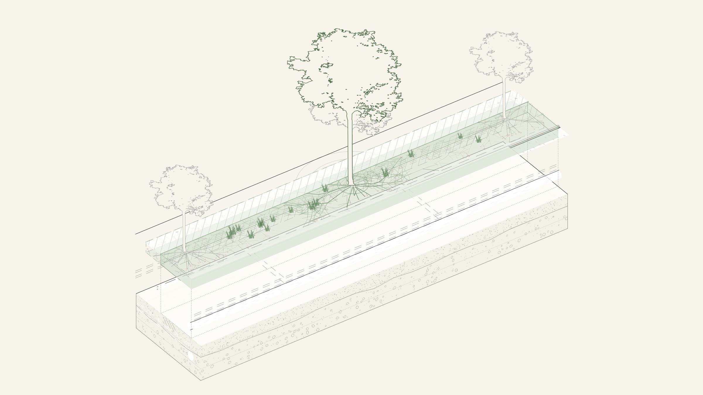
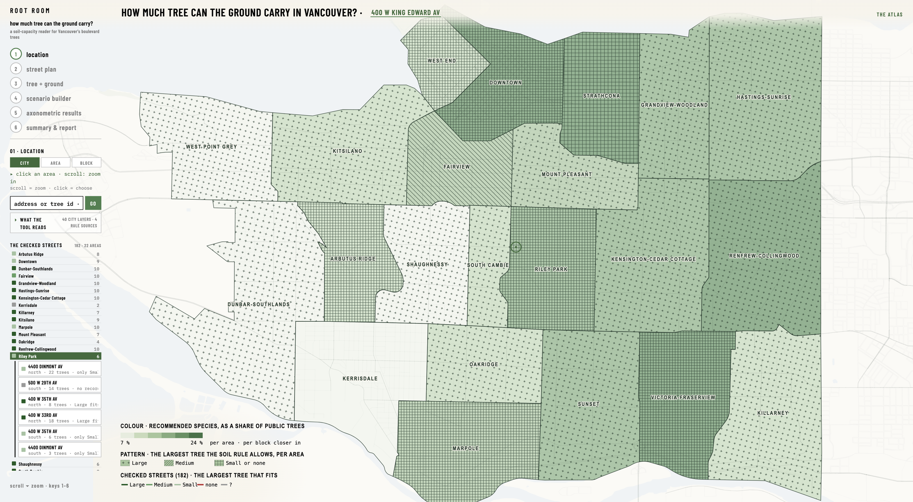
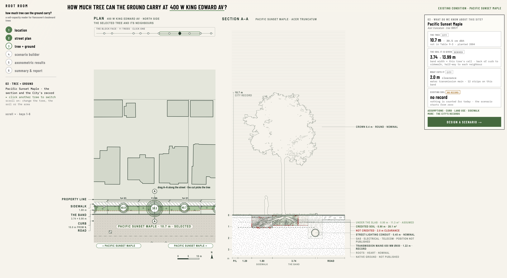
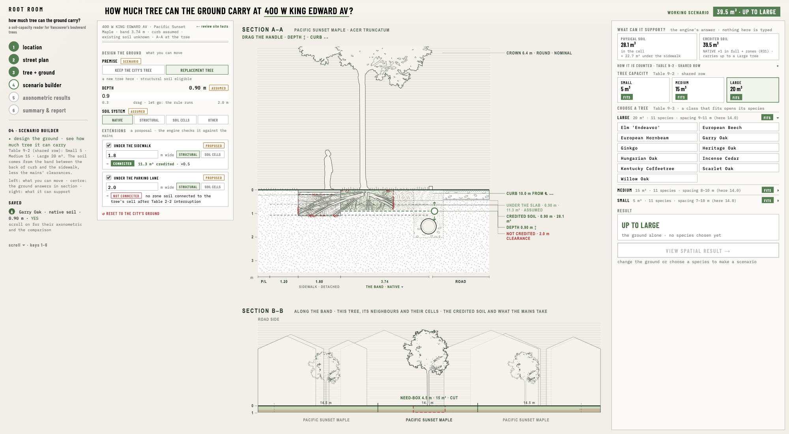

# Root Room

### How much tree can the ground carry?

ARCH 540 · Assignment 1 · Making Design Knowledge Interactive



## Purpose

Vancouver's street tree standards say how much soil a tree of each size needs. The number alone does not show what that volume means on a real street, where a tree shares the ground with sidewalks, roads, utilities, pavement and neighbouring trees.

Root Room turns the soil volume requirement into a spatial design question. It takes a real Vancouver street condition and tests how changes to soil depth, soil system and connected soil space change the amount of credited soil and the size of tree the site can support.

The goal is not simply to calculate soil volume. It is to understand how the ground itself can be designed to make more room for trees.

## What it does

**street condition → ground design → credited soil volume → tree size**

Root Room starts from a real public street tree, reads the City's data about the tree and the street around it, lets you propose a ground condition (soil depth, soil system, connected soil space), calculates the physical and the credited soil volume, and compares the result with the City's requirements. The answer is drawn as well as counted: a plan, two sections, an exploded axonometric and, from the same saved scenario, Rhino geometry.

## Run the demo

Python 3.10+ and one package. The page loads three.js and jsPDF from a CDN, so the browser needs internet access.

```bash
pip install jsonschema
python3 scripts/serve_web.py --port 8767
```

Open **http://127.0.0.1:8767/** in a desktop browser (composed for 1500 × 800 and up). The pilot street, the 400 block of West King Edward Avenue, is ready to use: this repository carries its City data. Any other street works too; its City data is fetched on first use and kept (about two minutes the first time). The engine and the exporter run inside the server: the first run after a start takes about six seconds, after that a tree click answers in four to five seconds and a ground change in two to three.

## The six stages

One question runs through the page, *how much tree can the ground carry at …?*, and one continuous scroll answers it in six stages on one drawing. The rail's steps, the keys 1–6 and the arrow keys jump between them. Every run shows itself: a bar along the top of the sheet fills over the time the last run took, and the stage tag counts the seconds.



**1 · location.** The city as an atlas. Scroll zooms through three levels (CITY · AREA · BLOCK); a click chooses the subject at each level: a local area, one of its checked streets, or, at the block level, any public tree as a dot. The rail lists what the tool reads (the City layers and the rule sources) and the checked streets of the focused area, 182 block faces in the 22 local areas. Any address or tree id typed into the title runs the engine for a new street.

**2 · street plan.** The whole block face at one scale: the property line, the sidewalk, the band, the curb, the road, every tree with its share of the band in m³, the mains' clearance strips hatched across the band. Click a tree and its SECTION A–A opens beside the plan; the A–A mark drags along the street and picks the tree it crosses.



**3 · tree + ground.** Before anything is changed, what is known about this site: the tree's City record, the band it is given (width × its cell), what cuts it (the mains and their Table 2-2 clearances), and the existing soil, which the City does not record. Each value carries its tag (see *What the tool knows*). A curb measured on site can be entered here with its evidence and replaces the assumed curb.



**4 · scenario builder.** Design the ground and see how much tree it can carry. Left: the premise (keep the City's tree, or a replacement tree), the soil depth, the soil system (native, structural, soil cells), and two extension proposals, under the sidewalk and under the parking lane. Centre: SECTION A–A with the depth handle, and SECTION B–B along the band with the neighbours, their cells, the credited soil and what the mains take. Right: the physical and the credited volume, the Table 9-2 tiles (Small · Medium · Large, FITS or NO ROOM), the Table 9-3 species of each class that fits, one result, and VIEW SPATIAL RESULT, which saves the scenario as a file.

**5 · axonometric results.** The scenario as an exploded axonometric: the credited soil lifted off the block as a planter with the roots inside, the proposed tree in ink and the City's tree as a ghost, the mains at their recorded depth, the native ground drawn as a soil section and captioned as a convention. Drag to turn it. The stage follows wherever 02–04 left the street; a saved scenario is what Rhino and the report read.

**6 · summary & report.** The saved scenarios beside the existing condition: cards, a comparison table (species, class, premise, soil system, depth, zones, band width, available and required volume, the result), VIEW FULL INFORMATION, and DOWNLOAD REPORT, a PNG of the sheet and a two-page PDF.

## The rule behind it

Root Room operates one small part of the City of Vancouver Engineering Design Manual (2026): **Section 9.3 Urban Forest** and its **Table 9-2 Soil Volumes for Street Trees**, which ties a required soil volume to a tree size class. Around that table the tool reads what the table needs to be applied on a real street:

| source | what it decides | where it is on the page |
|---|---|---|
| EDM Table 9-2 | the volume a Small, Medium or Large tree needs (shared row) | 04 TREE CAPACITY tiles, the result, 06's table |
| EDM Table 9-3 | the City's street tree list by size class; a species never has a class inferred | 04 CHOOSE A TREE, the species chips |
| EDM Tables 8-3 and 8-4 | the sidewalk and back-boulevard widths of the land-use row, hence the band's width between the back of curb and the sidewalk | 03 THE SOIL IT IS GIVEN, the plan's dimensions |
| EDM Table 2-2 | the clearance each main takes from the band; the band is interrupted there | the plan's hatched strips, the section's red NOT CREDITED edge |
| the crediting rule | native soil counts in full, structural soil at one half, soil cells for new trees only | 04 SOIL SYSTEM, HOW IT IS COUNTED |
| extension zones (R31) | soil proposed under the sidewalk or the parking lane counts when it connects to the tree's cell past the mains | 04 EXTENSIONS · CONNECTED / NOT CONNECTED |
| the premise (R20) | an existing tree's Table 9-2 value is a benchmark; a replacement tree is sized by what the ground gives | 04 PREMISE |

The tool does not translate the whole manual. It asks one question, *how does a soil volume requirement become a spatial design decision on a real street?*, and turns the answer into an operation that can be repeated for any site and any set of inputs. The rules as the engine reads them are in `sources/06_rules.json`, each cited to the page of the manual it comes from; the manual itself is not included, the City publishes it.

## How the calculation works

For the chosen tree the engine measures the block face from City geometry: the street centreline, the property line from the block outlines and parcels, the trees on the face and their spacing, the right-of-way. The band between the back of curb and the sidewalk is apportioned to the trees as cells, and the mains' clearances are cut out of it. A scenario adds the proposed depth, soil system and extensions; the engine returns the physical volume (footprint × depth), the credited volume (physical × the soil system's credit, plus connected zones), and the Table 9-2 classes that volume carries. The page draws the same numbers: the band and the cell in plan, the credited soil and the need-box in section, the planter in the axonometric. The purpose is not only to say how many cubic metres there are, but to show which spatial change produced the number.

## What the tool knows

Not everything on the page has the same source, and the page keeps them apart with four tags:

- **CITY** · read from a City record: the tree (species, height, diameter, planting year), its position, the street geometry, the mains in plan, the recorded depths where VanMap publishes them.
- **DERIVED** · calculated from City geometry: the band width, a tree's cell and spacing, the share of the band it is given, the clearances that cut it.
- **ASSUMED** · introduced by the tool or the designer and shown as such: the curb line where the City publishes none (from the catch basins), the land-use row, and at 04 every proposed value (PROPOSED).
- **NO RECORD** · not available in the source material. The City has no record of the existing soil under a street tree, so the existing soil volume stays NO RECORD; nothing is counted for today, and the page says so. A proposed depth can be introduced in a scenario, but it is an assumption, never an existing condition.

Below grade, the roots and the native strata are drawn as a landscape section draws them, and captioned as a drawing convention, not data. Every drawn depth carries its grade (City record · derived · nominal · not published).

## Web and Rhino

The web tool is for interaction: move through the site, pick a tree, change the ground, run the rule, see the spatial answer at once. A saved scenario is one file, `data/processed/scene_<site>_<ID>.json`, and Rhino reads that file alone: a builder script (run through the RhinoAI MCP in Rhino 8, kept with the working files rather than in this repository) rebuilds the street, the band's cells at their credited volumes, the extensions, the mains and the tree as geometry, and its cell volumes match the engine's. The browser does not yet display the Rhino output; for now the browser is the interactive spatial preview and Rhino the second representation of the same scenario, from the same logic.

**web → saved scenario → Rhino geometry**

## What Root Room does not decide

It does not decide whether an existing tree should stay or be removed; the premise is yours, and the tool shows what each premise implies. It does not predict tree health or survival. It does not claim to know underground conditions that the source data does not hold. It never treats a proposed scenario as an existing condition. It is not a compliance checker for the Engineering Design Manual; it works one relationship between street space, soil volume and tree size, to support spatial testing and design decisions around it.

## Command line

The same engine runs for any City tree without the page:

```bash
python3 scripts/run_site.py --address "2819 W 11th Av"        # lists the trees at that address
python3 scripts/run_site.py --asset-id 10880 --site-type boulevard \
    --curb 4.2 --depth 0.9 --target Medium --soil native_soil --land-use residential_detached
```

The first run for a new area fetches the City Open Data context, the underground layers and the VanMap depth layers for a 500 m window and reuses them afterwards. Output: `data/processed/block_face_V-<asset_id>.json`, every number with its provenance. An existing soil typed with evidence (`--existing-width --existing-depth --existing-soil --existing-provenance CONFIRMED_SITE_DATA --existing-evidence …`) is counted; typed without evidence it is marked USER_INPUT.

## Repository

| | |
|---|---|
| `web/` | the page: `one.html`, `js/one.js` (the six stages, the drawings, the panels), `js/scene.js` (the three.js scene), `css/`, `assets/` (the line-art trees), `models/` |
| `src/` | the engine: `sites.py` (any tree → a SITE record), `block_face.py` (measure the face, apportion the band, evaluate), `rule_engine.py`, `calculations.py`, `schema_validation.py`; the server's API `web_api.py`, `scene_api.py` (runs the engine and the exporter in-process, freezes scenarios), `window_index.py` (which City window files a site needs) |
| `scripts/` | `serve_web.py` (the server), `run_site.py` (any tree), `run_block_face.py`, `export_scene.py` (the scene file the page draws), `fetch_context.py`, `fetch_vanmap.py`, `fetch_ground_layers.py` |
| `sources/` | the rules (`06_rules.json`), the record schema, the drawing standard, the Table 9-3 transcription, the Street Tree Guidelines and root-atlas extracts |
| `data/` | `raw/` the pilot window's City files as served (Open Data, `vanmap/`), `processed/` the pilot's engine and scene files and the atlas summary, `species/` the species library |
| `docs/` | the captures in this README |

## Data

| what | from | in the repository |
|---|---|---|
| every public tree, the streets, the local areas | City of Vancouver Open Data | yes (`data/raw/`) |
| the pilot street's underground layers (mains, conduits, catch basins, poles) and VanMap depths | City Open Data · VanMap | yes (`*__king_edward_window.geojson`) |
| the same for any other street | fetched on first use by `scripts/fetch_context.py` and `fetch_vanmap.py` | no: fetched, then kept, ignored by git |
| the 182 checked block faces (the atlas colours) | a batch run of this engine | summary only (`citywide_faces.json`) |
| the Table 9-3 species library | EDM 2026 + City tree counts | yes (`data/species/`) |

City data is used under the City of Vancouver Open Government Licence.

## Status and limits

- The pilot street is ready; any other City tree runs from the City's data on first visit (about two minutes, with the fetch).
- The existing soil has no City record anywhere; the page shows NO RECORD and counts nothing for today. A measured existing soil can be typed with evidence on the command line, not yet on the page.
- Species are drawn as the library's line-art billboards; Rhino species models are parked.
- The Rhino model is built on the author's machine from the saved file; the public hosting of the demo, and with it how the Rhino build reports back to the page, is not decided.
- Composed for a desktop window of 1500 × 800 and up. `?t=1.5 / 2.5 / 3.5 / 4.85 / 5.5` opens the page at a stage.

## Sources

City of Vancouver Engineering Design Manual (2026), §9.3 Urban Forest, §8.4 boulevards, Table 2-2 clearances; Protection of Trees By-law 9958; Street Tree Guidelines (2011); the City's standard detail drawings; City of Vancouver Open Data and VanMap layers; the Vancouver Park Board Park Development Standards and the Wageningen root atlas as the references for how the sections and the roots are drawn.
